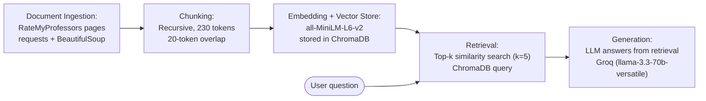

# Project 1 Planning: The Unofficial Guide

> Write this document before you write any pipeline code.
> Your spec and architecture diagram are what you'll use to direct AI tools (Claude, Copilot, etc.) to generate your implementation — the more specific they are, the more useful the generated code will be.
> Update the Retrieval Approach and Chunking Strategy sections if you change your approach during implementation.
> Update this file before starting any stretch features.

---

## Domain

The domain I chose is Rate My Profesors. This knowledge is valuable because these 
are real reviews that students who have taken the class submitted.

---

## Documents

| # | Source | Description | URL or location |
|---|--------|-------------|-----------------|
| 1 | Rate My Profesor | Lina Kloub's RMP | https://www.ratemyprofessors.com/professor/2754387 | 
| 2 | Rate My Profesor | Olga's RMP | https://www.ratemyprofessors.com/professor/2963544 |
| 3 | Rate My Profesor | Swamy's RMP | https://www.ratemyprofessors.com/professor/3044671 |
| 4 | Rate My Profesor | Justin's RMP | https://www.ratemyprofessors.com/professor/3127655 |
| 5 | Rate My Profesor | David Strimple's RMP | https://www.ratemyprofessors.com/professor/2872422 |
| 6 | Rate My Profesor | Derek's RMP | https://www.ratemyprofessors.com/professor/2460362 |
| 7 | Rate My Profesor | Laurent's RMP | https://www.ratemyprofessors.com/professor/1135923 |
| 8 | Rate My Profesor | Timothy Curry's RMP | https://www.ratemyprofessors.com/professor/2945690 |
| 9 | Rate My Profesor | Zhije's RMP | https://www.ratemyprofessors.com/professor/1282131 |
| 10 | Rate My Profesor | Alexander Russell's RMP | https://www.ratemyprofessors.com/professor/1691848 |

---

## Chunking Strategy

**Chunk size:**
230 tokens

**Overlap:**
20 tokens

**Reasoning:**
Since each review is separate from each other, the overlap doesn't have to be as drastic since it will be searching
for key words only. Recursive chunking strategy is best for these documents. Chunk size is capped at 230 tokens
(rather than a larger value) because all-MiniLM-L6-v2 only embeds the first 256 tokens of any input — anything
beyond that is silently truncated, so 230 leaves headroom for the "Professor:" prefix while keeping every chunk
fully within the model's window. At this size the recursive splitter packs ~2-3 short reviews per chunk.

---

## Retrieval Approach

<!-- Which embedding model are you using (e.g., all-MiniLM-L6-v2 via sentence-transformers)?
     How many chunks will you retrieve per query (top-k)?
     If you were deploying this for real users and cost wasn't a constraint, what tradeoffs
     would you weigh in choosing a different embedding model — context length, multilingual
     support, accuracy on domain-specific text, latency? -->

**Embedding model:**
All-MiniLM-L6-v2 via sentence-transformers

**Top-k:**
The top-k for our project is 3-5 but around 5 similar chunks is good.

**Production tradeoff reflection:**
I might use a larger hosted model like OpenAI text-embedding-3-large for better accuracy on heavier review texts with slang and higher retrieval quality. It would also weigh in multilingual spport if reviews span different languages.

---

## Evaluation Plan

| # | Question | Expected answer |
|---|----------|-----------------|
| 1 | Are Lina Kloub's exams difficult? | Lina Kloub's exams might seem a bit difficult but fair since the material on the exams if everything she has shown. |
| 2 | Do students recommend taking Swamy's class? | 86% of students recommend taking Swamy's class with a lot of students saying he is caring. |
| 3 | Is attendance mandatory for Olga's class? | Attendance for Olga's class is not mandatory and lectures are often not helpful. |
| 4 | Is David Strimple's grading rubric harsh? | Many students suggest David Strimple is a tough grader and that you will have to learn everything yourself. |
| 5 | What teaching style do reviews describe for David Strimple? | Many students suggest that the profesor expects you to know a lot and doesn't teach. Instead, he reads from really bad slides and talks about his life. |

---

## Anticipated Challenges

1. Off-topic and wrong-profesor retrieval since most of the RMP pages have similar or near identicial language. 

2. RMP reviews openly disagree and there is no ground truth.

---

## Architecture

---

## AI Tool Plan

**Milestone 3 — Ingestion and chunking:**
I plan on giving Claude Code my Documents and Chunking Strategy section and ask it to implement an ingestion algorithm to process
the Rate My Profesor pages into a clean, machine-readable format. Then I'll ask it to implement a chunk_text() with my specified
chunk size and overlap based on the reviews on Rate My Profesor.

**Milestone 4 — Embedding and retrieval:**
I plan on giving Claude Code the Retrieval Approach section with the embedding model used and top-k to implement a retrieval per
query algorithm with my specified top-k value.

**Milestone 5 — Generation and interface:**
I plan on giving Claude Code the Evaluation Plan section with the questions and expected answers to implement a generation algorithm.
I expect the generation code to have similar results to the expected answers based on the question given. The generation response
should be similar to the expected answer based on that specific question.
